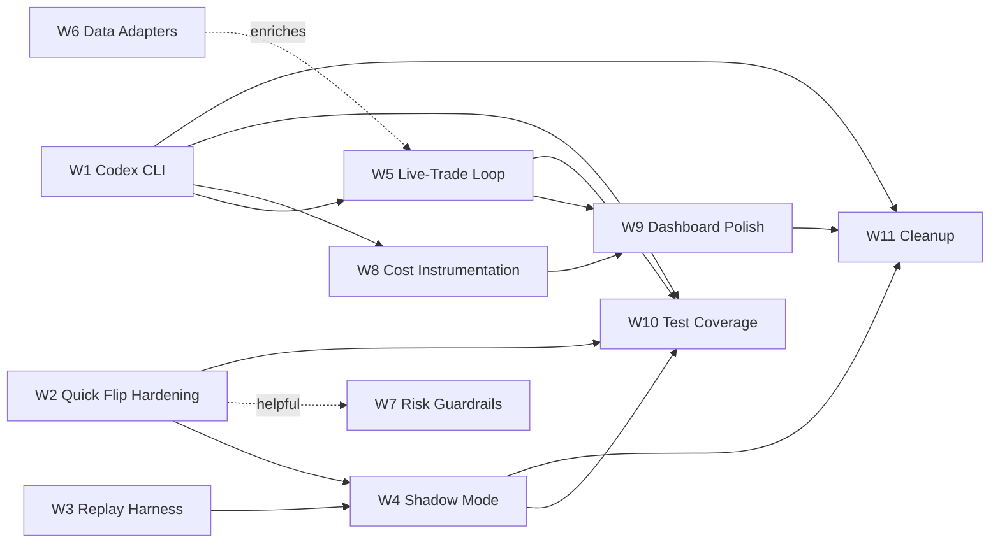

# Kalshi AI Trading Bot — Improvement Plan (Quick Flip + Live Trading Focus)

> **Living document.** Future agents working on any workstream below MUST update the
> "Status" tag in their workstream and the **Project Management Map** at the bottom
> when they complete, block, or reshape work. If this file gets too long, link out to
> per-workstream files under `docs/plans/` rather than deleting context.
>
> Last updated: 2026-04-24 by Codex - the dedicated W5 CLI loop now supports paper, shadow, and live runtimes; generic live-trade intents execute in live mode; live quick-flip intents route through the existing quick-flip machinery when `ENABLE_LIVE_QUICK_FLIP=1`; the main AI-ensemble `python cli.py run --live` path now also embeds the live-trade loop; and the `/live-trade` decision feed now combines low-latency SQLite-backed SSE refresh with client-side reconnect / HTTP sync fallback. Broader parity coverage still remains.

> 2026-04-23 local follow-up: W7 guardrails are now wired through the directional decision path in `src/jobs/decide.py` and the unified allocation path in `src/strategies/unified_trading_system.py`; mixed-schema spend summaries were hardened in both Python and Node; regression coverage was added for the new alias/summary cases. W5/W10/W11 remain open.
>
> 2026-04-24 local follow-up: W5 is no longer "not started" in practice. The repo already contains `src/jobs/live_trade.py`, the `python cli.py run --live-trade` entrypoint, persisted `live_trade_decisions` / `live_trade_runtime_state` / `live_trade_decision_feedback` tables, and the `/live-trade` dashboard decision feed with SSE + feedback actions. This pass added focused regression coverage for the no-events skip path and specialist-payload fallback (`tests/test_live_trade_loop_regressions.py`) and hardened the Node acceptance fixtures in `server/tests/liveTradeFeedbackSse.test.ts` and `server/tests/dashboardRepository.test.ts`. Remaining W5/W10 gaps are live-mode execution wiring, optional write-triggered decision-feed refresh, and broader parity/shadow coverage.
>
> 2026-04-24 local follow-up: the W5 live-mode startup skip is gone for non-`QUICK_FLIP` intents. `src/jobs/live_trade.py` now drives the existing generic execution path with `live_mode=True`, persists truthful `paper_trade` / `live_trade` flags on decision rows, and records live-specific execution summaries. Dedicated `python cli.py run --live-trade` now supports `paper`, `shadow`, and `live` runtimes, and live `QUICK_FLIP` intents now route through the existing quick-flip machinery when `ENABLE_LIVE_QUICK_FLIP=1`, with the standalone loop also running the quick-flip manager each cycle so exits, repricing, and reconciliation stay active. On the dashboard side, `server/src/repositories/dashboardRepository.ts` now exposes a lightweight live-trade decision refresh cursor, `server/src/services/liveStreamHub.ts` polls that cursor every <=1s, and the web client now falls back to explicit reconnect / HTTP sync when the SSE feed goes stale. A follow-up visibility pass now persists explicit per-decision `runtime_mode`, threads verified worker-mode / exchange-source metadata through the decision-feed heartbeat, and softens the live-trade banners when the UI is only seeing `dashboard env` defaults instead of `live_trade_runtime_state`. Focused regression coverage landed in `tests/test_live_trade_job.py`, `tests/test_cli_safety.py`, `server/tests/dashboardRepository.test.ts`, `server/tests/liveTradeFeedbackSse.test.ts`, and `web/lib/live-trade-decision-feed.test.ts`. Remaining W9/W10 gaps are broader parity coverage and any future fully push-based Python -> Node refresh hook if we decide to remove cursor polling entirely.
>
> 2026-04-24 automation follow-up: the legacy `XAIClient` shim now respects `LLM_PROVIDER=codex` instead of silently falling through to OpenRouter, shared `TradingDecision` / `DailyUsageTracker` dataclasses were extracted to a neutral `src/clients/shared_types.py` module with compatibility re-exports left in place, quick-flip's heuristic fallback flag moved onto `settings.trading.quick_flip_disable_ai`, and the CLI Codex quota suffix now counts only `llm_queries` rows so it matches the dashboard's quota semantics instead of double-counting `analysis_requests`.
>
> 2026-04-25 automation follow-up: W11 compatibility cleanup was hardened so the shared LLM dataclasses now export explicitly from both `src/clients/shared_types.py` and the legacy `src/clients/xai_client.py` shim, while the `scripts/beast_mode_dashboard.py` wrapper and legacy-pickle compatibility stay covered by focused Python tests.

---

## 1. Context

The repo today is a working Kalshi prediction-market bot with:

- A **5-model AI ensemble** ([src/agents/](src/agents/), [src/jobs/decide.py](src/jobs/decide.py)) routed through `LLM_PROVIDER=auto|openai|openrouter` ([src/config/settings.py:46-63](src/config/settings.py#L46-L63)).
- A **quick-flip scalping strategy** ([src/strategies/quick_flip_scalping.py](src/strategies/quick_flip_scalping.py), ~1,950 lines) — math-based, with maker-entry attempts, dynamic exits, fee-aware profit floors, paper simulation, and live settlement reconciliation. Recent commits (`10d0694`, `a9db594`, `f2318d9`, `dcc6c8c`) cleaned up fee handling and added simulated-order tracking.
- A **live-trade pipeline** ([src/data/live_trade_research.py](src/data/live_trade_research.py), ~1,390 lines) feeding a Next.js `/live-trade` route via the FastAPI [python_bridge/app/main.py](python_bridge/app/main.py) and Fastify `/api/live-trade` route. Filters short-dated events by `LIVE_WAGERING_MAX_HOURS_TO_EXPIRY` (default 12h) and enriches with Sports / BTC / News context.
- A **paper trading runtime** that writes to the same `trading_system.db` as live ([src/paper/tracker.py](src/paper/tracker.py), [src/jobs/execute.py](src/jobs/execute.py)) — paper entries snapshot the live best ask, exits rest locally and reconcile against periodic book snapshots.

**Where we're going:** narrow the bot's focus to two short-term betting paths:

1. **Quick flip** — pure math, fee-aware, fast-cycle. Already mostly built; needs accuracy hardening, paper/live parity proof, and a few edge-case fixes.
2. **Live trading** — agent-driven, in-play decisions on short-dated Sports / Crypto / Financials / Economics events. Currently a single-shot research call; needs a real multi-agent decision loop with cheap-fast models.

**Provider shift:** default agent calls should run on a **ChatGPT/Codex CLI** subprocess so quota comes from the user's ChatGPT plan, not API-key billing. OpenRouter remains the fallback for non-OpenAI models in the ensemble.

**Acceptance bar:** the bot runs in paper mode with high-fidelity simulation (replay harness + shadow-trade mode) until P&L tracks live within an acceptable tolerance, then we flip the switch.

---

## 2. Strategic Goals (in priority order)

1. **G1 — Codex-first AI routing.** Add a `codex` provider that invokes the Codex CLI signed in to a ChatGPT plan. Make it the default when available.
2. **G2 — Paper accuracy you can trust.** Replay harness + shadow-trade mode + parity assertions before we sign off on live.
3. **G3 — Quick flip production-readiness.** Close known accuracy gaps (entry-snapshot drift, resting-order race, fee rounding) and add observability.
4. **G4 — Live-trade agent loop.** Promote the live-trade flow from a single research call to a multi-agent in-play decision pipeline, fed by category-specific data adapters.
5. **G5 — Risk guardrails for live.** Per-strategy circuit breakers and budget caps that work the same in paper and live.
6. **G6 — Dashboard + observability.** Make paper-vs-live divergence and per-strategy P&L impossible to miss.
7. **G7 — Cleanup.** Retire legacy paths (Streamlit dashboard, beast mode default, `xai_client.py`).

---

## 3. Workstreams

Each workstream is sized for **one subagent** working in parallel with the others. Every workstream lists its **Owner**, **Depends on**, **Files**, **Done when**, **Status**.

### W1 — Codex CLI Provider Integration  *(Status: complete — merged to main 2026-04-23, commit `ca0dbb0`)*

> **Follow-ups flagged by W1 agent:**
> - W5 can call `router.get_completion(..., capability=...)` and route through Codex transparently; `create_structured_completion(prompt, schema=...)` is the right call for structured per-agent outputs.
> - W8 can pivot on `router.get_cost_summary()["providers"]["codex"]` + existing `llm_queries.strategy='codex'` + `tokens_used` without any schema change. Optional provider column on `LLMQuery` would be cleaner.
> - Pre-existing test-isolation bug in `tests/test_openrouter_client.py::test_router_sends_one_request_with_fallback_models` (does not patch settings — fails when `OPENAI_API_KEY` is set). W10 should sweep similar tests.
> - 2026-04-24 automation follow-up: `src/clients/xai_client.py` now initializes `CodexClient` when the effective provider resolves to `codex`, so older runtime paths (`trade.py`, `decide.py`, performance jobs) no longer bypass the Codex-first routing default.
- **Owner:** Backend Architect or Senior Developer subagent
- **Depends on:** none
- **Goal:** Add a third value to `LLM_PROVIDER` (`codex`) that shells out to the official `codex` CLI (signed in via ChatGPT plan), and make it the new default when the CLI is detected on PATH.
- **Files to touch:**
  - [src/config/settings.py](src/config/settings.py#L46-L96) — extend `_resolve_default_llm_provider()` so `auto` prefers `codex` if `which codex` succeeds and Codex is logged in, then `openai`, then `openrouter`. Add `_get_default_*_model` branches for Codex.
  - New: `src/clients/codex_client.py` — async subprocess wrapper that mirrors the `OpenAIClient` interface (`create_completion`, `create_structured_completion`). Stream stdout, parse, enforce JSON schema, capture token counts from CLI output (best-effort; fall back to 0).
  - [src/clients/model_router.py](src/clients/model_router.py#L1-L130) — register Codex models in `CAPABILITY_MAP` and a new `CODEX_FULL_FLEET`. Health tracking re-uses `ModelHealth`.
  - [env.template](env.template) — document `CODEX_CLI_PATH`, `CODEX_PLAN_TIER`, fallback behavior.
  - [README.md](README.md#L209-L218) — replace the "ChatGPT/Codex plan access is separate" note with the new flow.
  - New: `tests/test_codex_client.py` — mock `asyncio.create_subprocess_exec` and assert structured-output parsing + fallback when CLI is missing.
- **Done when:**
  - `LLM_PROVIDER=codex` runs an end-to-end ensemble call without touching OpenAI billing.
  - `LLM_PROVIDER=auto` picks Codex over OpenAI when the CLI is present and authenticated.
  - The `daily_cost_tracking` table records Codex calls with `cost_usd=0.0` but a non-null `tokens_used` so plan quota usage is still observable.
  - Existing OpenAI / OpenRouter behavior is unchanged when Codex is unavailable.

### W2 — Quick Flip Accuracy Hardening  *(Status: complete — merged to main 2026-04-23, commit `a9ca8eb`)*

> **Follow-ups flagged by W2 agent:**
> - **Dashboard hook landed on 2026-04-23 (`65be4cf`).** `/portfolio` now renders fee-drift telemetry when exposed by the API, and `get_paper_live_divergence_summary()` appends a fee-divergence CLI summary from `fee_divergence_log`. Remaining gap: exit-leg fee reconciliation is still not wired.
> - **Exit-leg fee reconciliation not yet wired.** Entry leg writes to `fee_divergence_log`; exit leg lives in `quick_flip_scalping._close_position_from_recent_fills` and `place_sell_limit_order` live branch — neither calls `record_fee_divergence(leg='exit')` today. Trivial follow-up.
> - `QUICK_FLIP_DISABLE_AI` is read via `os.environ.get` inline. Move to `settings.trading` once the surface area calms down (W1 already merged).
> - If `get_orderbook` fails on the paper entry path, Gap 1 silently falls back to the old best-ask snapshot. Good enough for tests; call out if W3/W4 rely on depth protection being on.
- **2026-04-24 automation follow-up:** both of the stale notes above are now resolved locally: exit-leg fee divergence is already wired and covered in `tests/test_quick_flip_scalping.py` / `tests/test_execute.py`, and the quick-flip AI fallback flag now lives on `settings.trading.quick_flip_disable_ai` with docs/env-template coverage.
- **Owner:** Senior Developer
- **Depends on:** none (parallel-safe)
- **Goal:** Close the three known gaps in [src/strategies/quick_flip_scalping.py](src/strategies/quick_flip_scalping.py) and [src/jobs/execute.py](src/jobs/execute.py).
- **Specifics:**
  1. **Entry snapshot drift** ([execute.py:639-715](src/jobs/execute.py#L639-L715)) — paper entry uses a single best-ask snapshot. Add a "depth-aware" simulation that walks the visible book, applies partial fills, and reports realized average price. This matches what a FOK limit can actually achieve.
  2. **Resting-order collision** ([execute.py:519-620](src/jobs/execute.py#L519-L620)) — multiple paper exits for the same `(market_id, side)` race during reconciliation. Key resting orders by `position_id` and add a unique constraint in [src/utils/database.py](src/utils/database.py).
  3. **Fee rounding edge case** ([src/utils/trade_pricing.py:115-148](src/utils/trade_pricing.py#L115-L148)) — paper applies the public 7%/1.75% formula at quote time; live can differ when Kalshi returns a `fee_cost` on the fill. Add a reconciliation pass that, when live `fee_cost` is available, persists the **actual** fee to `trade_logs.entry_fee` / `exit_fee` and emits a divergence metric.
  4. **AI-less fallback path** — quick flip currently requires an AI movement-prediction call ([quick_flip_scalping.py:1166-1258](src/strategies/quick_flip_scalping.py#L1166-L1258)). Add `--no-ai` mode that uses pure recent-trade momentum + book-depth heuristics (already partially encoded in lines 1120-1142). This keeps quick flip running when the daily AI budget is exhausted or Codex is unreachable.
- **Done when:** new tests in [tests/test_quick_flip_scalping.py](tests/test_quick_flip_scalping.py) and [tests/test_execute.py](tests/test_execute.py) cover all four cases; divergence metric appears in dashboard portfolio view.

### W3 — Paper-Trading Replay Harness  *(Status: complete — merged to main 2026-04-23, commit `bbe3e97`)*

> **Follow-ups flagged by W3 agent:**
> - `KALSHI_REPLAY_MODE=1` env hook is currently unused in production code; it's the documented escape hatch if strategy/execute ever needs to branch on replay-mode. W2 could adopt it instead of the mock-client path if it wants to short-circuit network calls.
> - Default per-tick snapshot cost is ZERO extra HTTP requests (inline-from-`markets` payload). The "full" path in `write_market_snapshots` adds one `get_orderbook` + one `get_market_trades` per ticker — useful for targeted high-fidelity capture, not the default.
> - `book_top_5_json` always includes all four `yes_bids/yes_asks/no_bids/no_asks` arrays, synthesized from market info when the orderbook API omits them. Downstream replay consumers never have to re-derive.
- **Owner:** AI Engineer or Backend Architect
- **Depends on:** none (can start parallel; informs W4)
- **Goal:** Re-run the last N days of recorded order-book snapshots and live trades against the paper-execution code path, then assert simulated P&L tracks live within tolerance.
- **Approach:**
  - Add a snapshot writer to [src/jobs/ingest.py](src/jobs/ingest.py) that periodically dumps `(timestamp, ticker, book_top_5, last_trade)` to a new `market_snapshots` SQLite table (or JSONL file under `data/snapshots/`). Default sample rate: every quick-flip scan tick.
  - New: `scripts/replay_paper.py` — feeds snapshots through [src/strategies/quick_flip_scalping.py](src/strategies/quick_flip_scalping.py) and [src/jobs/execute.py](src/jobs/execute.py) in paper mode, rebuilds a parallel `trading_system_replay.db`, and prints a side-by-side P&L diff with the live `trade_logs` table.
  - Tolerance gate: paper P&L within ±5% of live P&L per 100 trades; per-trade fee delta < $0.01.
- **Done when:** `python scripts/replay_paper.py --days 7 --strategy quick_flip` produces a deterministic report and exits non-zero if tolerance is breached. CI (or a smoke target) runs it weekly.

### W4 — Shadow-Trade Mode  *(Status: complete — merged to main 2026-04-23, commit `21ecaef`)*
- **Follow-ups flagged by Codex after merge:**
  - Drift observability is live in `cli.py status` and `/portfolio`, but the optional "auto-pause on drift threshold" enforcement hook is still not wired. Treat that as a focused follow-up if we want automatic guardrails instead of dashboard-only monitoring.
  - `shadow_orders` is now the canonical comparison lane for order-drift telemetry. Older databases without that table still fall back to legacy `simulated_orders.live` splits in the dashboard repository.
- **Owner:** Senior Developer
- **Depends on:** **W2** (accuracy fixes), **W3** (snapshot infra)
- **Goal:** Run paper and live executions side-by-side on the same signals so we can observe drift continuously, not just historically.
- **Approach:**
  - New CLI flag: `python cli.py run --shadow` (paper-only orders, but logs the *would-be* live order to a new `shadow_orders` table with the same schema as `simulated_orders`).
  - On every settlement / fill, compute `(paper_pnl - live_pnl)` per trade and per category, surface in the `/portfolio` dashboard route.
  - Auto-pause if drift exceeds a configurable threshold.
- **Done when:** dashboard shows a "Paper vs Live divergence" panel with rolling 24h / 7d windows, and `cli.py status` prints a one-line drift summary.

### W5 — Live-Trade Multi-Agent Decision Loop  *(Status: in progress - paper-first scout/specialist/final-synth loop, persisted decision logging, dedicated CLI runtime, dashboard feed, safe generic live execution, opt-in live quick-flip execution, and main `run --live` integration are in-tree; broader parity coverage remains)*
- **Follow-ups flagged by 2026-04-24 review:**
  - `src/jobs/live_trade.py` now runs scout -> specialist -> final synth in paper and live modes. Non-`QUICK_FLIP` intents call the existing generic executor with `live_mode=True`, and persisted decision rows now mark `paper_trade` / `live_trade` truthfully.
  - Dedicated `python cli.py run --live-trade` now supports paper, shadow, and live runtimes; the standalone loop also runs the quick-flip manager each cycle so quick-flip exits / repricing stay active when the loop is run on its own.
  - Live `QUICK_FLIP` intents now require `ENABLE_LIVE_QUICK_FLIP=1` and route through the existing quick-flip machinery. `src/jobs/trade.py` now runs `run_live_trade_loop_cycle()` inside the main AI-ensemble runtime for paper, shadow, and live modes, so the embedded and dedicated paths share the same W5 loop. The remaining product gap is broader parity proof.
- **Owner:** AI Engineer (lead) + Sales Engineer–style subagent for prompt design
- **Depends on:** **W1** preferred (so Codex powers the loop) but can prototype on OpenAI/OpenRouter first
- **Goal:** Replace the single-shot LLM call inside [src/data/live_trade_research.py](src/data/live_trade_research.py) with a real multi-agent loop tuned for short-dated, in-play markets.
- **Design:**
  1. **Scout agent** — cheap/fast model, scans the ranked event list every N seconds and shortlists 3–5 markets worth deeper analysis. Default model: `x-ai/grok-4.1-fast` or Codex equivalent.
  2. **Specialist agents** — focus-type-specific:
     - **Sports specialist** — consumes live score / drive / period from the sports adapter ([server/src/services/external/sportsDataService.ts](server/src/services/external/sportsDataService.ts)).
     - **Crypto specialist** — consumes BTC OHLC + funding from CoinGecko ([live_trade_research.py:998-1020](src/data/live_trade_research.py)).
     - **Macro specialist** — consumes news sentiment + economic-calendar context from [src/data/news_aggregator.py](src/data/news_aggregator.py).
  3. **Risk gate** — re-uses [src/agents/risk_manager_agent.py](src/agents/risk_manager_agent.py); enforces category-confidence multipliers ([settings.py:256-261](src/config/settings.py#L256-L261)).
  4. **Trader synth** — re-uses [src/agents/trader_agent.py](src/agents/trader_agent.py) and [src/agents/ensemble.py](src/agents/ensemble.py) for the final decision; emits a structured order intent.
- **Wire-up:**
  - New job module: `src/jobs/live_trade.py`. Cron-driven from [cli.py](cli.py) under a new `python cli.py run --live-trade` flag. Supports paper, shadow, or live execution semantics on the dedicated loop path.
  - Persist every agent step to a new `live_trade_decisions` table for replay/debugging.
  - Surface the active decision queue on the existing `/live-trade` Next.js route ([web/app/live-trade/page.tsx](web/app/live-trade/page.tsx)) via a new SSE topic.
- **Done when:** the loop runs end-to-end in paper mode, executes via `quick_flip_scalping` order machinery when the trader's intent is a sub-30-min flip, and the `/live-trade` page shows live decisions streaming in.

### W6 — Focus-Type Data Adapter Hardening  *(Status: complete — merged to main 2026-04-23, commit `d9b350d`)*

> **Follow-ups flagged by W6 agent:**
> - Node-side `sportsDataService.ts` capabilities NOT mirrored in Python: `fetchTeamSchedule`, `fetchSummary` (play-by-play, leaders, injuries, boxscore). If a W5 specialist needs any of these, grow `SportsAdapter.fetch_summary(event_id, league)` / `fetch_team_schedule(league, team_id)`. Until then those enrichments still round-trip through the Node `/api/live-trade` path.
> - No `requirements.txt` changes — `httpx`, `feedparser`, `structlog` were already present. W6 agent notes `feedparser` is categorized under "News & sentiment pipeline" but macro adapter shares it; cosmetic recategorization if anyone cares.
> - All adapters import fine but are NOT yet called from production code; W5 is the intended first consumer.
- **Owner:** Data Engineer subagent
- **Depends on:** parallel with W5; W5 is the consumer
- **Goal:** Make the per-category enrichment robust enough for the live-trade agents to depend on.
- **Specifics:**
  - **Sports:** confirm [server/src/services/external/sportsDataService.ts](server/src/services/external/sportsDataService.ts) covers NCAAB / NBA / NFL live state (score, period, possession). Add Python-side mirror in `src/data/sports_adapter.py` so the agents can pull without going through the Node server.
  - **Crypto:** extend `live_trade_research.py` BTC fetch to also pull funding + 1m/5m bars; add `src/data/crypto_adapter.py`.
  - **Economics:** wire an economic-calendar source (Trading Economics free RSS, or scrape the Kalshi event description). Add `src/data/macro_adapter.py`.
  - All adapters expose the same `async fetch_context(market) -> dict` contract for the W5 agents.
- **Done when:** each adapter has a unit test and a 60-line README in `docs/data_adapters/`.

### W7 — Risk Guardrails for Live  *(Status: complete — merged to main 2026-04-23, commit `8ca31a4`)*

> **Follow-ups flagged by W7 agent (CRITICAL — blocks W5):**
> - **`PortfolioEnforcer` is now wired into quick-flip entries as of 2026-04-23 (`65be4cf`), but the broader live trade-execution flow is still incomplete.** `src/strategies/quick_flip_scalping.py` now checks portfolio budgets before opening a quick-flip trade. Remaining integration work is still needed in `src/jobs/execute.py`, `src/jobs/decide.py`, and the future W5 live-trade loop order-placement path.
> - `python cli.py status` currently requires Kalshi API access (it hits `/get_balance`) and the new strategy-budget block is appended inside that same code path. In envs without Kalshi creds, budgets remain invisible. Restructure `cmd_status` to surface budgets independent of API reachability — noted as out of scope here.
> - Per-strategy env vars (`QUICK_FLIP_DAILY_LOSS_BUDGET_PCT`, `LIVE_TRADE_MAX_TRADES_PER_HOUR`, etc.) are read via `os.environ.get` with `TODO: promote to TradingConfig after W1 merges` markers. W1 is now merged — a cleanup pass can migrate these into `settings.trading`.
> - 2026-04-23 local follow-up: `portfolio_enforcer` now treats `directional_trading`, `portfolio_optimization`, and `immediate_portfolio_optimization` as `live_trade` aliases for daily-loss, trade-rate, and open-position checks, and the directional decision/allocation paths now consult the enforcer before returning or placing positions. Remaining integration work is the future W5 live-trade loop.
> - 2026-04-26 follow-up: W5 live-trade loop now calls `PortfolioEnforcer` with `MODE_LIVE` when `shadow_mode_enabled=True`, so shadow and live share parity guards for hourly rate cap, open-position caps, and daily-loss halts.
- **Owner:** Backend Architect
- **Depends on:** W2 fee-divergence metric is helpful but not required
- **Goal:** Make sure the existing portfolio enforcer and category scorer kick in on the new live-trade flow as well as the legacy decide path.
- **Specifics:**
  - Per-strategy circuit breakers (quick flip vs live trade) in [src/strategies/portfolio_enforcer.py](src/strategies/portfolio_enforcer.py).
  - Hourly trade-rate cap for live trade (default 20/hr, per [TradingConfig.max_trades_per_hour](src/config/settings.py#L287)).
  - Per-strategy daily-loss budget (e.g. quick flip 5% of bankroll, live trade 5%) with a hard halt when breached.
  - Make sure `--shadow` mode reads the same config so paper and live share guardrails.
- **Done when:** [tests/test_cli_safety.py](tests/test_cli_safety.py) covers the new circuit breakers, and `python cli.py status` shows budget remaining per strategy.

### W8 — Cost & Budget Instrumentation  *(Status: in progress — `llm_queries.role` migration + rollup fallback is live as of 2026-04-26, with schema/quota cleanup still open)*
- **Follow-ups flagged by Codex after merge:**
  - Provider/role/strategy spend telemetry now renders in the portfolio route using the current `analysis_requests.provider` and `llm_queries.query_type/strategy` fields. The explicit `llm_queries.provider` schema cleanup from the original plan is still open.
  - Codex quota-vs-dollar accounting is still only partially represented (`cost_usd=0`, runtime query counts, and provider rollups). If we want first-class quota reporting, add a dedicated persisted quota/usage field and thread it through the dashboard/API.
  - 2026-04-23 local follow-up: the CLI/database provider summary now uses a shared recent 7-day window for both provider totals and logged-query totals, and the Node dashboard repository no longer assumes `analysis_requests` has a `tokens_used` column when aggregating provider spend. Regressions landed in `tests/test_llm_query_provider.py` and `server/tests/dashboardRepository.test.ts`.
  - 2026-04-24 automation follow-up: the CLI Codex quota suffix now counts only `llm_queries` request/token rows, matching `server/src/repositories/dashboardRepository.ts` instead of inflating quota telemetry with `analysis_requests`.
- **Owner:** Analytics Reporter subagent
- **Depends on:** W1 (Codex calls need to land in `daily_cost_tracking` with `cost_usd=0`)
- **Goal:** A single panel that shows AI spend split by provider (Codex / OpenAI / OpenRouter), by agent role, and by strategy, plus quota-vs-dollar accounting for the Codex plan.
- **Specifics:**
  - Add provider/role columns to [src/utils/database.py](src/utils/database.py) `llm_queries` table if missing.
  - Extend [src/jobs/performance_dashboard_integration.py](src/jobs/performance_dashboard_integration.py) to expose the breakdown.
  - New panel on `/portfolio` (or a new `/spend` page) consuming the data.
- **Done when:** dashboard panel renders with at least 24h of real data and `cli.py status` prints today's spend per provider.

### W9 — Dashboard Live-Trade Polish  *(Status: in progress — dashboard polish is stable in-tree with optional shared-stream migration and optional push-based refresh hook remaining)*
- **Follow-ups flagged by 2026-04-24 review:**
  - `/live-trade` already mounts `LiveTradeDecisionsPanel`, subscribes to the `live-trade-decisions` SSE topic, and exposes thumbs-up / down feedback writes. The old "live SSE/feedback work remains" note is stale.
  - `server/src/services/liveStreamHub.ts` now polls a lightweight decision/runtime/feedback cursor every <=1s and refreshes the SSE snapshot when SQLite state changes, with the existing slower full-refresh interval still acting as fallback.
  - The current remaining polish is mostly about optional migration onto the shared stream hook and any future push-based Python -> Node refresh hook if cursor polling proves insufficient.
- **Owner:** Frontend Developer
- **Depends on:** W5 (data shape) and W8 (cost panel)
- **Goal:** Make `/live-trade` and `/portfolio` actually useful for monitoring the new flow.
- **Specifics:**
  - `/live-trade` ([web/app/live-trade/page.tsx](web/app/live-trade/page.tsx)) — show live agent decisions streaming in (new SSE topic from W5), with action buttons to thumbs-up / down a decision (writes to a feedback table for later evaluation).
  - `/portfolio` ([web/app/portfolio/page.tsx](web/app/portfolio/page.tsx)) — paper-vs-live divergence panel from W4, AI-spend panel from W8, per-strategy P&L breakdown.
  - Keep decision-feed heartbeat metadata and page banners aligned so operators can tell whether the visible mode comes from verified worker telemetry (`live_trade_runtime_state`) or dashboard defaults.
- **Done when:** A user can sit on `/live-trade` and `/portfolio` for 10 minutes and confidently say what the bot is doing and how it's doing.

### W10 — Test Coverage Gaps  *(Status: in progress — live-trade execution/parity regressions are mostly landed as of 2026-04-26, but full route-level paper/live parity and broader stress parity remain open)*
- **Follow-ups flagged by 2026-04-24 review:**
  - Added `tests/test_live_trade_loop_regressions.py` to cover the no-events skip branch and the specialist-payload fallback branch without modifying the existing dirty `tests/test_live_trade_job.py`.
  - Added live-mode execution assertions in `tests/test_live_trade_job.py` so the loop now proves it reaches the safe generic live executor, marks persisted decision rows with truthful paper/live flags, and stores live positions when `live_trading_enabled` is on.
  - Added dedicated-loop quick-flip coverage in `tests/test_live_trade_job.py` for live quick-flip opt-in blocking, opted-in live quick-flip routing, and the standalone loop's per-cycle quick-flip manager behavior.
  - Added a loop-level shadow-mode success case in `tests/test_live_trade_job.py` that uses the real `execute_position` path, preserves `runtime_mode="shadow"`, and verifies `shadow_orders` divergence telemetry is written for the executed entry.
  - Added a repeated-cycle regression in `tests/test_live_trade_job.py` so the same market cannot be reopened on the next loop pass while an earlier position is still open; the newest execution row now stays auditable as `status="skipped"` / `error="existing_position"`.
  - Hardened the Node acceptance harness so `server/tests/liveTradeFeedbackSse.test.ts` parses the intended JSON payload even when child-process logs/warnings are present, added SSE coverage for external SQLite writes that change the decision feed, repaired the new quota/strategy-P&L fixtures plus the refresh-cursor repository coverage in `server/tests/dashboardRepository.test.ts`, and added focused web-side feed precedence / fallback coverage in `web/lib/live-trade-decision-feed.test.ts`.
- **Owner:** API Tester or Test Results Analyzer
- **Depends on:** W1, W2, W4, W5 (tests live alongside the code they cover)
- **Goal:** Fill in the coverage holes flagged during exploration.
- **Specifics:**
  - End-to-end agent-debate test on the live-trade route (no real Kalshi calls — use recorded snapshots from W3).
  - Paper-vs-live parity test that asserts the same input produces the same logical decision (entry side, qty bucket, exit price tier).
  - Codex CLI subprocess test (W1).
  - Shadow-mode drift-threshold test (W4).
- **Done when:** `pytest --cov=src` shows ≥80% coverage on the strategies, jobs, and clients packages.

### W11 — Legacy Cleanup  *(Status: in progress — compatibility hardening landed as of 2026-04-26; final removals still blocked by remaining downstream callsites)*
- **Owner:** Code Reviewer subagent
- **Depends on:** W1 (Codex stable), W4 (shadow mode operational), W9 (dashboard polished)
- **Goal:** Remove the old paths now that the new ones work.
- **Candidates:**
- `beast_mode_dashboard.py` / `scripts/beast_mode_dashboard.py` legacy dashboard entrypoints — keep the repo-root module canonical and retain the script path as a thin compatibility wrapper until downstream callers are gone.
- `beast_mode_bot.py` (entry point, redundant with `cli.py run --beast`).
- `src/clients/xai_client.py` (only `TradingDecision` and `DailyUsageTracker` are still imported by [src/clients/model_router.py:15](src/clients/model_router.py#L15) — extract them to a small standalone module first, then delete).
- Legacy paper signal tracker in [src/paper/tracker.py](src/paper/tracker.py) (signals-only path) — keep only the unified runtime path.
- 2026-04-26 hardening note: `scripts/beast_mode_dashboard.py` is retained as a compatibility wrapper, and `src/clients/xai_client.py` now carries explicit legacy-shim documentation for downstream callers.
- 2026-04-26 automation follow-up: `src/clients/xai_client.py` now mirrors provider usage into persisted daily counters (request_count + total_cost) so legacy daily-limit checks remain accurate across tracker reloads.
- **Done when:** files removed, README updated, `pytest` still green.

---

## 4. Project Management Map

### Dependency graph (Mermaid)

### What can run in parallel right now (Wave 1)

| Lane | Workstreams | Subagent type |
|------|-------------|---------------|
| A | **W1** Codex CLI | Backend Architect or Senior Developer |
| B | **W2** Quick Flip Hardening | Senior Developer |
| C | **W3** Replay Harness | AI Engineer / Backend Architect |
| D | **W6** Data Adapters | Data Engineer |
| E | **W7** Risk Guardrails (foundations) | Backend Architect |

### Wave 2 (after Wave 1 unlocks)

| Lane | Workstream | Unblocked by |
|------|-----------|--------------|
| A | **W4** Shadow Mode | W2 + W3 |
| B | **W5** Live-Trade Loop (full) | W1 (preferred) + W6 |
| C | **W8** Cost Instrumentation | W1 |

> 2026-04-23 update: W4 is now merged to main in `21ecaef`. W8 has a merged first slice (portfolio spend panels + CLI provider summary), but its schema/quota follow-ups remain open.

### Wave 3 (after Wave 2)

| Lane | Workstream | Unblocked by |
|------|-----------|--------------|
| A | **W9** Dashboard Polish | W5 + W8 |
| B | **W10** Test Coverage | W1, W2, W4, W5 |

### Wave 4

| Workstream | Unblocked by |
|------------|--------------|
| **W11** Legacy Cleanup | W1 + W4 + W9 stable in production-paper mode |

### Status legend (future agents update inline in §3)

- `not started` — nobody owns it yet
- `in progress (owner: <name>, branch: <branch>)`
- `blocked (reason: ...)`
- `complete (PR: #..., merged: <date>)`
- `superseded (link: ...)`

---

## 5. Verification Plan

The plan is "done" when the following can be demonstrated end-to-end:

1. `python cli.py health` reports `provider=codex` when the CLI is signed in.
2. `python cli.py run --paper` exercises both quick flip and the new live-trade agent loop, drawing AI calls from the Codex plan (no API-key cost).
3. `python scripts/replay_paper.py --days 7` exits 0 with paper P&L within ±5% of live P&L.
4. `python cli.py run --shadow` runs for 24h with the dashboard's paper-vs-live divergence panel staying under threshold.
5. `python cli.py status` shows per-strategy P&L, per-strategy daily-loss budget remaining, and per-provider AI spend.
6. `pytest --cov=src` shows ≥80% on strategies/jobs/clients with new tests for Codex, replay, shadow, and live-trade decisions.
7. After 7 trading days of clean shadow-mode results, `python cli.py run --live` is the green-light moment.

---

## 6. Critical Files Future Agents Should Touch (quick index)

- Strategy logic: [src/strategies/quick_flip_scalping.py](src/strategies/quick_flip_scalping.py), [src/strategies/unified_trading_system.py](src/strategies/unified_trading_system.py)
- Execution: [src/jobs/execute.py](src/jobs/execute.py), [src/jobs/track.py](src/jobs/track.py), [src/jobs/decide.py](src/jobs/decide.py)
- Live-trade research: [src/data/live_trade_research.py](src/data/live_trade_research.py)
- Agents: [src/agents/](src/agents/), especially [ensemble.py](src/agents/ensemble.py) and [debate.py](src/agents/debate.py)
- Provider routing: [src/clients/model_router.py](src/clients/model_router.py), [src/clients/openai_client.py](src/clients/openai_client.py), [src/clients/openrouter_client.py](src/clients/openrouter_client.py), **new** `src/clients/codex_client.py`
- Config: [src/config/settings.py](src/config/settings.py), [env.template](env.template)
- Database: [src/utils/database.py](src/utils/database.py)
- Fee math: [src/utils/trade_pricing.py](src/utils/trade_pricing.py)
- Dashboard: [web/app/live-trade/page.tsx](web/app/live-trade/page.tsx), [web/app/portfolio/page.tsx](web/app/portfolio/page.tsx), [server/src/app.ts](server/src/app.ts), [python_bridge/app/main.py](python_bridge/app/main.py)
- Tests: [tests/test_quick_flip_scalping.py](tests/test_quick_flip_scalping.py), [tests/test_execute.py](tests/test_execute.py), [tests/test_ensemble.py](tests/test_ensemble.py), [tests/test_live_trade_research.py](tests/test_live_trade_research.py)

---

## 7. Hand-off Protocol for Future Agents

When picking up a workstream:

1. Read the §3 entry for that workstream and the dependency edges in §4.
2. Update its **Status** line in §3 to `in progress (owner: <agent-type>, branch: <git branch>)`.
3. Re-explore only the files in the workstream's "Files to touch" list — don't re-explore the whole repo.
4. If you discover the workstream needs to be split, edit §3 to reflect that and update §4's PM map.
5. On completion, change Status to `complete (PR: #..., merged: <date>)` and tick the corresponding line in §5.
6. If a finding changes the plan for *other* workstreams, append a short note under that workstream's entry — don't overwrite the original intent.

If a workstream grows past ~300 lines of plan content, move its details to `docs/plans/W<#>-<slug>.md` and keep just a one-paragraph summary + link here.
